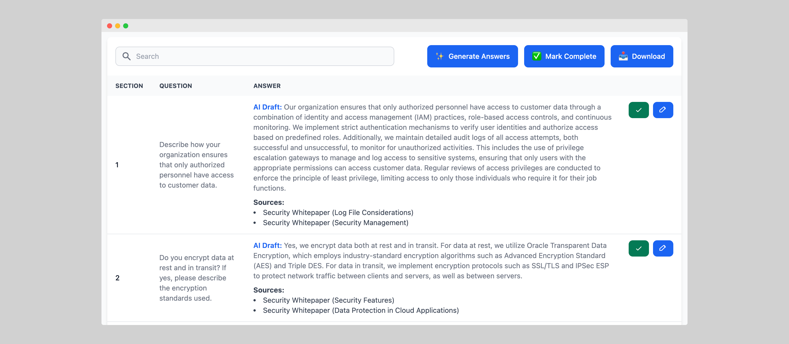

# WinifyAI – Security Questionnaire Automation with AI

[WinifyAI](https://www.winifyai.com/) helps companies automate time-consuming security questionnaires using AI. Instead of answering hundreds of repetitive vendor questions manually, WinifyAI lets you upload your internal documentation and generate accurate answers in seconds.

---

## 🚀 Try WinifyAI Free

Get started with a free trial – no credit card required.

👉 [Try Our Security Questionnaire Automation Tool →](https://www.winifyai.com/features/security-questionnaire-automation/)

---

## 🧪 Sample Security Questionnaires and Knowledge Hub Documents

This repository includes **sample security questionnaires and compliance documents** you can explore and use to test WinifyAI.

### Folder structure:

samples/
|-- security-questionnaires/
| -- standard-questionnaire.pdf |-- knowledge-hub-docs/ -- acme-security-overview.pdf

### Available samples:

#### `/samples/security-questionnaires/`
- `standard-questionnaire.pdf` – 50 common vendor security questions

#### `/samples/knowledge-hub-docs/`
- `acme-security-overview.pdf` – Overview of security policies and posture

These files can be uploaded into WinifyAI’s Knowledge Hub to auto-generate answers for vendor questionnaires.

---

## 🔌 API Access (Coming Soon)

We're building a public API that will allow you to:
- Upload internal docs to the Knowledge Hub
- Parse security questionnaires (PDF, XLSX, DOCX)
- Generate answers using AI
- Export responses in your desired format

➡️ [Contact us](https://www.winifyai.com/contact/) to join the early access list.

---

## 📺 Product Demo

Watch a 2-minute walkthrough on our website.

---

## 🧠 Common Use Cases

- AI-powered security questionnaire response
- Vendor security assessments (SOC 2, ISO 27001, CAIQ)
- GRC and InfoSec compliance workflows
- Sales + Legal team support for enterprise deals

---

## 📎 Resources

- [What Is a Security Questionnaire?](https://www.winifyai.com/blog/security-questionnaire)
- [Automating Security Questionnaires with AI – Guide](https://www.winifyai.com/blog/how-to-automate-security-questionnaires)

---

## 🔗 Learn More

- 🌐 [Visit the WinifyAI Homepage](https://www.winifyai.com/)
- 📄 [Explore Security Questionnaire Automation →](https://www.winifyai.com/features/security-questionnaire-automation/)

---

## 💬 Contributing

Feel free to contribute new sample files or suggest improvements via GitHub Issues.

---

## 📜 License

This repository is licensed under the [Creative Commons Attribution-NonCommercial 4.0 International License](https://creativecommons.org/licenses/by-nc/4.0/).

