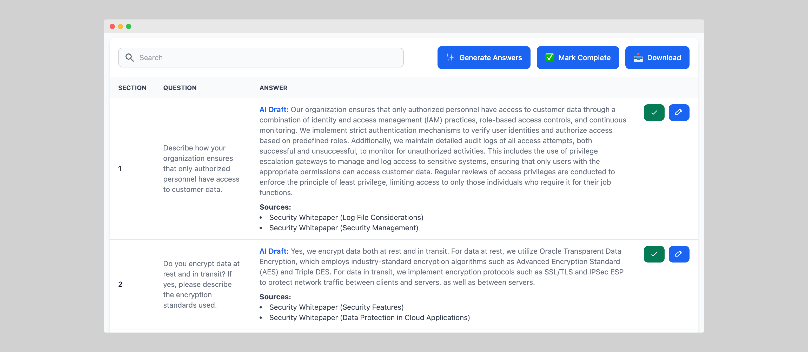

# WinifyAI – AI RFP Response Software for Public Sector Bids

[WinifyAI](https://www.winifyai.com/) helps companies respond to public sector RFPs, tenders, RFIs, and bid documents faster with AI.

Instead of manually reading long procurement documents, building compliance matrices, searching through past proposals, and rewriting the same answers across bids, WinifyAI lets teams upload their RFP documents, past responses, capability materials, and company knowledge to generate structured, grounded proposal drafts.

---

## Try WinifyAI Free

Start reviewing and responding to public sector bids faster with AI-powered proposal workflows.

[Try WinifyAI →](https://www.winifyai.com/)

---

## Sample RFPs and Knowledge Hub Documents

This repository includes sample public sector bid documents and supporting Knowledge Hub files you can use to test WinifyAI.

### Folder structure

```text
samples/
|-- rfps/
|   |-- sample-public-sector-rfp.pdf
|
|-- knowledge-hub-docs/
|   |-- acme-capability-statement.pdf
|   |-- acme-past-performance-summary.pdf
|   |-- acme-service-overview.pdf
```

### Available samples

#### `/samples/rfps/`

* `sample-public-sector-rfp.pdf` – Example public sector RFP document for testing requirement extraction, response planning, and proposal drafting.

#### `/samples/knowledge-hub-docs/`

* `acme-capability-statement.pdf` – Example company capability statement.
* `acme-past-performance-summary.pdf` – Example past performance summary for proposal reuse.
* `acme-service-overview.pdf` – Example service description and company knowledge document.

These files can be uploaded into WinifyAI’s Knowledge Hub and used to generate RFP briefs, compliance matrices, proposal outlines, and draft responses.

---

## What WinifyAI Helps With

WinifyAI supports companies responding to public sector bids across the RFP response workflow:

* Upload and analyze RFPs, RFIs, tenders, and procurement documents
* Generate strategic RFP briefs
* Extract requirements into a compliance matrix
* Create structured proposal outlines
* Reuse approved content from past proposals
* Draft responses grounded in company knowledge
* Manage recurring RFI, RFP, and questionnaire-style responses
* Review, refine, and export proposal content

---

## API Access

We're building API access that will allow teams to:

* Upload RFPs and supporting documents
* Parse PDFs, DOCX files, spreadsheets, and procurement documents
* Extract questions, requirements, and evaluation criteria
* Generate compliance matrices
* Draft proposal responses using approved knowledge sources
* Export structured response data for downstream workflows

[Contact us](https://www.winifyai.com/contact/) to join the early access list.

---

## Product Demo



See how WinifyAI helps teams turn public sector bid documents into structured response workflows.

---

## Common Use Cases

* Public sector RFP response automation
* Government contractor proposal drafting
* Tender response workflows
* Compliance matrix generation
* RFI and RFP response workflows
* Past performance reuse
* Proposal answer library management
* Capability statement and company knowledge reuse
* AI-assisted bid response workflows

---

## Resources

* [Visit the WinifyAI Homepage](https://www.winifyai.com/)
* [Explore RFP Response Software](https://www.winifyai.com/features/rfp-response-software/)
* [Explore Compliance Matrix Software](https://www.winifyai.com/features/compliance-matrix-software/)
* [Explore Proposal Answer Library](https://www.winifyai.com/features/proposal-answer-library/)
* [Read the WinifyAI Blog](https://www.winifyai.com/blog/)

---

## Learn More

* [Start with WinifyAI](https://www.winifyai.com/)
* [View Pricing](https://www.winifyai.com/pricing/)
* [Contact WinifyAI](https://www.winifyai.com/contact/)

---

## Contributing

Feel free to contribute sample public sector RFP files, proposal templates, or suggestions for improving the sample workflow via GitHub Issues.

Please do not contribute confidential, proprietary, controlled, or non-public procurement documents.

---

## License

This repository is licensed under the [Creative Commons Attribution-NonCommercial 4.0 International License](https://creativecommons.org/licenses/by-nc/4.0/).

[](https://creativecommons.org/licenses/by-nc/4.0/)
